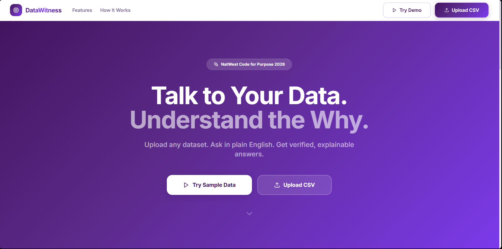
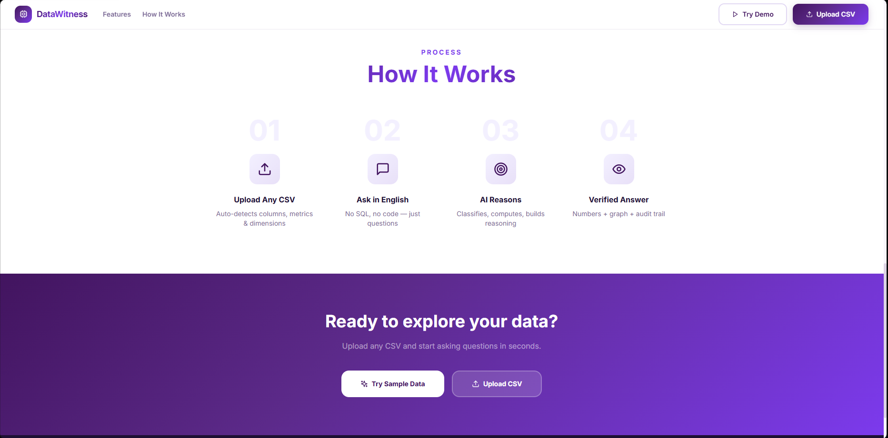
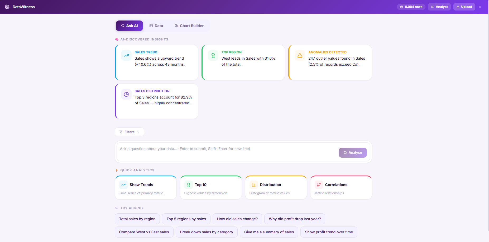
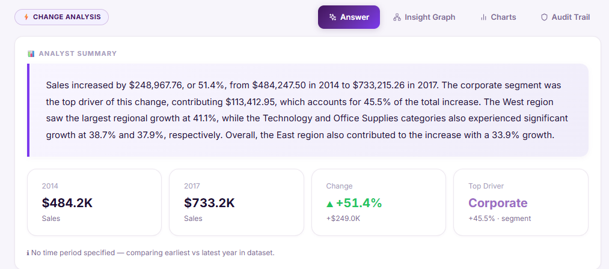
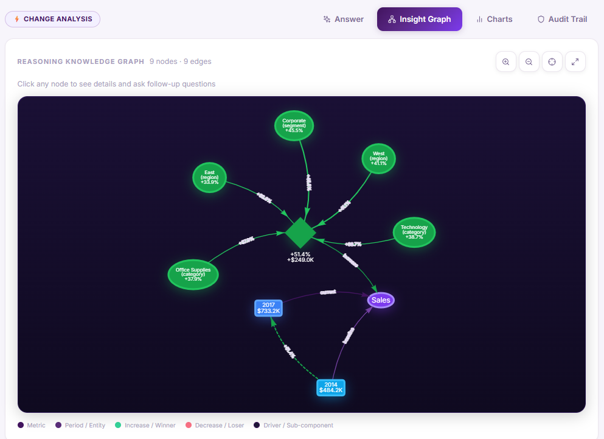
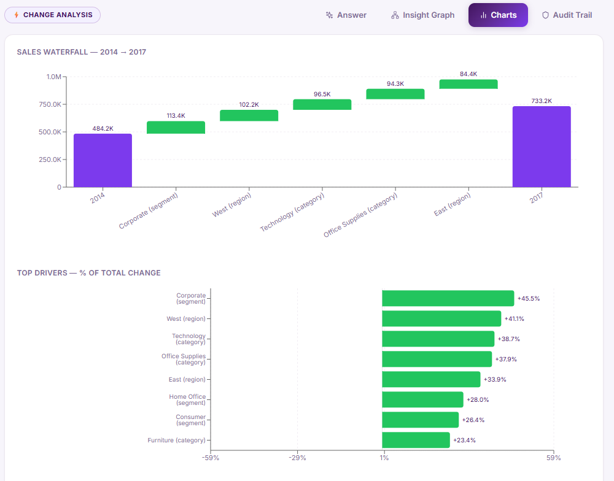
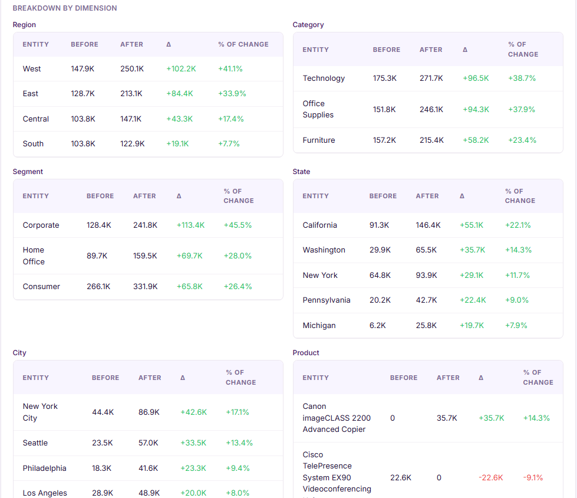
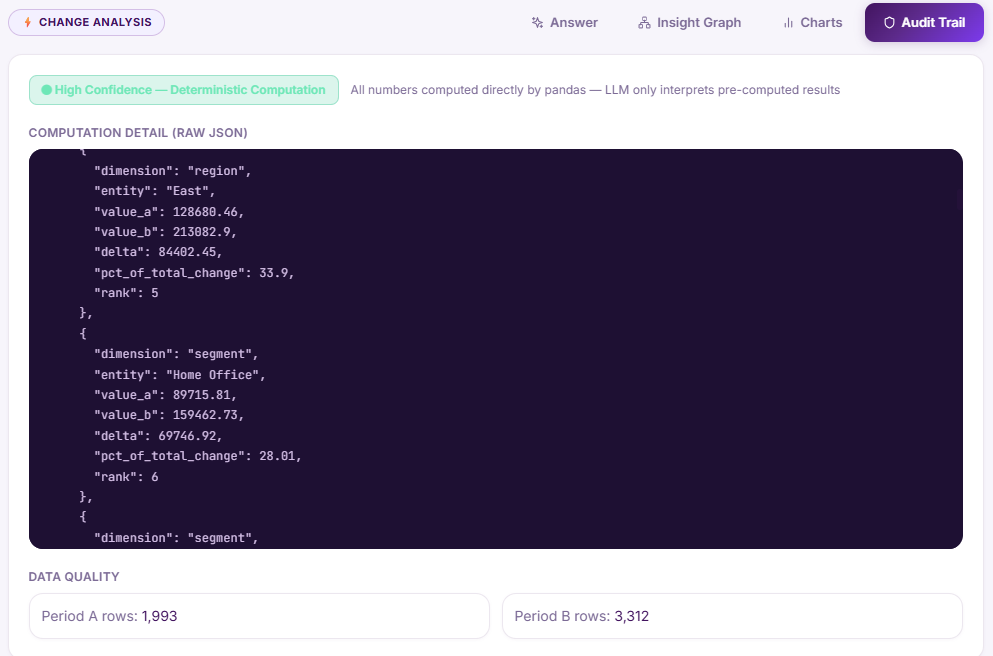

# DataWitness -- Visual Walkthrough

A step-by-step tour of the DataWitness interface, from landing page to audit trail.

---

## 1. Landing Page

The hero page introduces DataWitness with a clear value proposition. Users can either upload their own CSV or try the included Superstore sample dataset.

---

## 2. How It Works

A 4-step process overview explaining the pipeline: Upload any CSV, ask in plain English, AI reasons over the data, and every answer is verified with an audit trail.

---

## 3. Dashboard -- Smart Insights & Query Input

After loading a dataset, DataWitness auto-discovers patterns (trends, top entities, anomalies, concentration) and displays them as insight cards. The query input bar and suggested questions are shown below.

---

## 4. Change Analysis -- Narrative & Metrics

When a user asks "How did sales change?", the intent classifier routes it to the change detection engine. The answer panel shows a plain-English narrative alongside metric cards comparing the two periods.

---

## 5. Knowledge Graph -- Reasoning Visualization

The Insight Graph tab renders an interactive knowledge graph (via vis-network) showing how the metric changed, which periods were compared, and which entities drove the change. Nodes are sized by impact.

---

## 6. Charts -- Waterfall & Top Drivers

The Charts tab shows a waterfall chart decomposing the change from Period A to Period B, plus a horizontal bar chart ranking the top drivers by their percentage contribution to the total change.

---

## 7. Breakdown -- Dimension Tables

For breakdown queries, the result is decomposed across every relevant dimension (Region, Category, Segment, City, Product, etc.) with ranked tables showing values, shares, and change percentages.

---

## 8. Audit Trail -- Code & Data Quality

The Audit Trail tab shows the exact computation performed, the confidence score, the raw JSON of the structured result, and data quality metrics (rows used in each period). Every number is traceable.

---

*Built for NatWest Code for Purpose -- India 2026*
